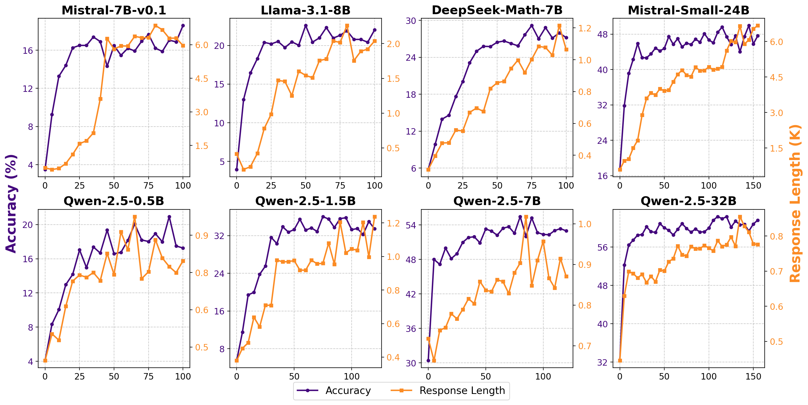

<div align="center">

# Simple Reinforcement Learning for Reasoning

[](https://arxiv.org/abs/2503.18892)  [](https://huggingface.co/collections/hkust-nlp/simplerl-zoo-67e0fd24c185423c1e3452d1)

</div>


This repo contains a simple reinforcement learning recipe to improve models' reasoning abilities. It is simple because only rule-based reward and GSM8K/Math datasets are used. We have used this code to successfully train 10 diverse base models with limited data (8K examples), achieving surprisingly strong results -- the accuracy gains range from 10 to more than 20 absolute points. These models include Llama3 8B, Mistral 7B/24B, DeepSeekMath 7B, Qwen2.5 0.5B/1.5B/7B/14B/32B, and Qwen2.5-Math-7B. While we observe significant increase in both response length and accuracy, we note that different models exhibit distinct reasoning behaviors during training, and the increased response length does not necessarily correlate with emergence of certain cognitive behaviors such as self-verification. We share many findings and practices in our paper, and we release the code, model checkpoints, and analysis tools here. 

> You may find an old version of this repo [here](https://github.com/hkust-nlp/simpleRL-reason/tree/v0), with our early results and codebase using OpenRLHF and PPO.

<div align="center">

</div>

> Accuracy and response length across training iterations for different models. Training starts from base models without any SFT. 

## News
- **[2025/03/24]** We perform successful zero RL training starting from 10 diverse base models. We release all 10 models and the code, and share many findings and practices in our [paper](https://arxiv.org/abs/2503.18892).   
- **[2025/02/19]** We release checkpoints of [Qwen-2.5-Math-7B-SimpleRL-Zero](https://huggingface.co/hkust-nlp/Qwen-2.5-Math-7B-SimpleRL-Zero) and [Qwen-2.5-Math-7B-SimpleRL](https://huggingface.co/hkust-nlp/Qwen-2.5-Math-7B-SimpleRL) to Huggingface. 
- **[2025/01/25]** We release the training/eval code and our blog. We are working on the paper and will release it very soon.


## Links 

* **Paper: SimpleRL-Zoo: Investigating and Taming Zero Reinforcement Learning for Open Base Models in the Wild**
  * 📝 [Paper](https://arxiv.org/abs/2503.18892)
  * 🤗 [Hugging Face Collection](https://huggingface.co/collections/hkust-nlp/simplerl-zoo-67e0fd24c185423c1e3452d1)
  * 💻 [Github](https://github.com/hkust-nlp/simpleRL-reason/tree/v1)

* **Blog: 7B Model and 8K Examples: Emerging Reasoning with Reinforcement Learning is Both Effective and Efficient**
  * 📝 [Blog](https://hkust-nlp.notion.site/simplerl-reason)
  * 🤗 [Hugging Face Collection](https://huggingface.co/collections/hkust-nlp/simplerl-67b543892b2ec6908ffff710)
  * 💻 [Github](https://github.com/hkust-nlp/simpleRL-reason/tree/v0)


## Main Results

### Mistral, Llama and DeepSeek Models
|            Model           | GSM8K | MATH 500 | Minerva Math | Olympiad Bench | AIME24  (Pass@1) | AIME24  (Avg@32) | AMC23 | Avg. |
|:--------------------------:|:-----:|:--------:|:------------:|:--------------:|:----------------:|:----------------:|:-----:|:----:|
| Mistral-v0.1-7B                 |  21.2 |    4.2   |      4.0     |       2.4      |        0.0       |        0.0       |  0.0  |  5.3 |
| 🦁 Mistral-v0.1-7B + SimpleRL-Zoo   |  75.0 |   15.8   |      6.6     |       4.1      |        0.0       |        0.2       |  10.0 | 18.6 |
| Llama-3.1-8B               |  39.7 |   13.6   |      4.8     |       3.1      |        0.0       |        0.2       |  2.5  | 10.6 |
| 🦁 Llama-3.1-8B + SimpleRL-Zoo  |  79.2 |   23.0   |      9.6     |       5.3      |        0.0       |        0.2       |  15.0 | 22.0 |
| DeepSeek-Math-7B           |  28.4 |   19.4   |      5.5     |       4.7      |        0.0       |        0.0       |  10.0 | 11.3 |
| 🦁 DeepSeek-Math-7B + SimpleRL-Zoo  |  78.5 |   39.6   |     21.0     |      12.6      |        3.3       |        0.6       |  20.0 | 29.2 |
| Mistral-Small-24B               |  78.6 |   43.6   |     10.7     |      11.6      |        3.3       |        0.5       |  17.5 | 27.6 |
| 🦁 Mistral-Small-24B + SimpleRL-Zoo    |  92.0 |   70.6   |     36.8     |      36.6      |       16.7       |       13.1       |  45.0 | 49.6 |


### Qwen Series Model

|              Model              | GSM8K | MATH 500 | Minerva Math | Olympiad Bench | AIME24  (Pass@1) | AIME24  (Avg@32) | AMC23 | Avg. |
|:-------------------------------:|:-----:|:--------:|:------------:|:--------------:|:----------------:|:----------------:|:-----:|:----:|
| Qwen-2.5-0.5B                   |  36.7 |   15.8   |      4.8     |       2.8      |        0.0       |        0.3       |  12.5 | 12.1 |
| 🦁 Qwen-2.5-0.5B + SimpleRL-Zoo          |  49.5 |   34.4   |     10.3     |       8.9      |        0.0       |        0.7       |  22.5 | 20.9 |
| Qwen-2.5-1.5B                   |  55.7 |   29.6   |      6.6     |       6.5      |        0.0       |        0.1       |  12.5 | 18.5 |
| 🦁 Qwen-2.5-1.5B + SimpleRL-Zoo          |  74.4 |   59.0   |     20.2     |      21.0      |        6.7       |        4.2       |  35.0 | 36.1 |
| Qwen-2.5-7B                     |  88.2 |   64.6   |     25.7     |      30.1      |        3.3       |        0.3       |  30.0 | 40.3 |
| 🦁 Qwen-2.5-7B + SimpleRL-Zoo            |  91.7 |   78.2   |     38.6     |      40.4      |       20.0       |       15.6       |  62.5 | 55.2 |
| Qwen-2.5-Math-7B                |  65.5 |   63.6   |     12.5     |      25.8      |       13.3       |        8.6       |  42.5 | 37.2 |
| 🦁 Qwen-2.5-Math-7B + SimpleRL-Zoo       |  90.2 |   80.2   |     37.5     |      39.0      |       40.0       |       24.0       |  70.0 | 59.5 |
| Qwen-2.5-14B                    |  91.6 |   65.4   |     24.3     |      33.5      |        6.7       |        3.4       |  37.5 | 43.2 |
| 🦁 Qwen-2.5-14B + SimpleRL-Zoo           |  94.4 |   80.2   |     40.4     |      44.9      |       23.3       |       14.2       |  57.6 | 56.8 |
| Qwen-2.5-32B                    |  92.9 |   68.6   |     27.9     |      31.1      |       10.0       |        4.5       |  45.0 | 45.9 |
| 🦁 Qwen-2.5-32B + SimpleRL-Zoo           |  95.9 |   82.4   |     42.6     |      46.4      |       36.7       |       27.2       |  67.5 | 61.9 |

> AIME is evaluated in two ways: Pass@1 (single run) and Avg@32 (average score from 32 runs). For AIME24 (Pass@1) and other benchmarks, baselines use greedy decoding, and models with ”zero RL training” use temperature=1 and top-p=0.95. For AIME24 (Avg@32), we sample 32 responses per model with the same settings. Average scores are based on AIME (Avg@1) and other benchmarks.
<!-- #### Increase of Response Length does not always correspond to the "aha moment"

#### Rigid Format Reward Harms Training of Some Base Models

#### Pass@K Improves Significantly

#### Traditional SFT as a Cold Start Harms RL -->


## Model Checkpoints
**We are open-sourcing all the Zero RL models as outlined below and will also release some of the intermediate checkpoints to support future research. Stay tuned for updates!**

All these models are also in our [Huggingface Collection](https://huggingface.co/collections/hkust-nlp/simplerl-zoo-67e0fd24c185423c1e3452d1). 
|Model|Link|
|-|-|
|Mistral-7B-v0.1-SimpleRL-Zoo|[🤗](https://huggingface.co/hkust-nlp/Mistral-7B-v0.1-SimpleRL-Zoo)|
|Llama-3.1-8B-SimpleRL-Zoo|[🤗](https://huggingface.co/hkust-nlp/Llama-3.1-8B-SimpleRL-Zoo)|
|DeepSeek-Math-7B-SimpleRL-Zoo|[🤗](https://huggingface.co/hkust-nlp/DeepSeek-Math-7B-SimpleRL-Zoo)|
|Mistral-Small-24B-SimpleRL-Zoo|[🤗](https://huggingface.co/hkust-nlp/Mistral-Small-24B-SimpleRL-Zoo)|
|Qwen-2.5-0.5B-SimpleRL-Zoo|[🤗](https://huggingface.co/hkust-nlp/Qwen-2.5-0.5B-SimpleRL-Zoo)|
|Qwen-2.5-1.5B-SimpleRL-Zoo|[🤗](https://huggingface.co/hkust-nlp/Qwen-2.5-1.5B-SimpleRL-Zoo)|
|Qwen-2.5-7B-SimpleRL-Zoo|[🤗](https://huggingface.co/hkust-nlp/Qwen-2.5-7B-SimpleRL-Zoo)|
|Qwen-2.5-14B-SimpleRL-Zoo|[🤗](https://huggingface.co/hkust-nlp/Qwen-2.5-14B-SimpleRL-Zoo)|
|Qwen-2.5-32B-SimpleRL-Zoo|[🤗](https://huggingface.co/hkust-nlp/Qwen-2.5-32B-SimpleRL-Zoo)|
|Qwen-2.5-Math-7B-SimpleRL-Zoo|[🤗](https://huggingface.co/hkust-nlp/Qwen-2.5-Math-7B-SimpleRL-Zoo)|


## Quick Start

### Installation

Our code is implemented based on [Verl](https://github.com/volcengine/verl). We provide basic environment setup for training as follows, which only support custom environment setup and [FSDP training](https://pytorch.org/tutorials/intermediate/FSDP_tutorial.html). 

```bash
conda create -n verl python==3.9
conda activate verl
pip3 install torch==2.4.0 --index-url https://download.pytorch.org/whl/cu124
pip3 install flash-attn --no-build-isolation
pip3 install -e . 
```

To install from docker image or utilize Megatron-lm, please refer to [Verl's documentation](https://verl.readthedocs.io/en/v0.2.x/start/install.html).

### Reproducing SimpleRL-Zoo

The minimum hardware requirement for training Qwen-2.5-0.5B is a single H/A100-80G GPU. To accelerate our experiments, we utilized 2x8 H100-80G GPUs to train 7B and 14B models for approximately 100 steps over 15 hours using 8K examples. For training the 32B models, we used 8x8 H100-80G GPUs, completing the training in 1.5 days with the same dataset.

The training process leverages GRPO with Ray and vLLM for acceleration. So firstly, you need to launch the ray cluster using the command below:
```bash
# launch the master node of ray 
ray start --head --node-ip-address 0.0.0.0 --num-gpus 8

# if you want to launch ray on more nodes, use
ray start --address {MASTER-NODE-ADDRESS}:6379  --num-gpus 8
```
The main script for training is train_grpo_math_tune_ray.sh. You need to specify the required environment variables in this script. Once configured, submit the training job from the master node.

Here are examples for different models:

* Qwen-2.5-7B (For models between 0.5B and 14B, we use `kl_loss_coef=1e-4`)
```bash
bash train_grpo_math_tune_ray.sh --model_name Qwen-2.5-7B --max_response_length 8192  --train_batch_size 1024 --rollout_n 8 --kl_loss_coef 0.0001 --entropy_coeffient 0.001 --rollout_gpu_memory_util 0.75 --rollout_tp 2 --save_freq 5  
```

* Qwen-2.5-32B (For > 14B models, we use `kl_loss_coef=1e-3`)
```bash
bash train_grpo_math_tune_ray.sh --model_name Qwen-2.5-32B --max_response_length 8192  --train_batch_size 1024 --rollout_n 8 --kl_loss_coef 0.001 --entropy_coeffient 0.001 --rollout_gpu_memory_util 0.75 --rollout_tp 8 --save_freq 5  
```

Note: The run name will depends on the model name and specific hyper-parameters to identify the training job. For example, above command will generate a run name like `verl-grpo_Qwen-2.5-32B_max_response8192_batch1024_rollout8_klcoef0.001_entcoef0.001_simplelr_math_35`. You can find the run name in terminal output. 

For other models, use the same command, adjusting the `--model_name` argument accordingly. 

### Evaluate

We used [Qwen Math's codebase](https://github.com/QwenLM/Qwen2.5-Math/tree/main/evaluation) for evaluation, but for fairness considerations, we completely prohibited solving problems by calling code. The `eval_math_nodes.sh` script provides the full pipeline for evaluation, results collection, and analysis. To use it, you'll need to specify a few environment variables within the script, and then run it as shown below:

Example: 
```bash
bash eval_math_nodes.sh \
    --run_name verl-grpo_Qwen-2.5-32B_max_response8192_batch1024_rollout8_klcoef0.001_entcoef0.001_simplelr_math_35   \
    --init_model Qwen-2.5-32B \
    --template qwen-boxed  \
    --tp_size 8 \
    --add_step_0 true  \
    --temperature 1.0 \
    --top_p 0.95 \
    --max_tokens 16000 \
    --benchmarks aime24,amc23,math500,olympiadbench,gsm8k,minerva_math \
    --n_sampling 1 
```

After running the script, the evaluation results will be saved in `$RUN_NAME/eval_results`, with the metrics from our paper (e.g., clip ratio, average response length, etc.) saved in `$RUN_NAME/eval_results/eval_results.csv`.

### Visualization

To compare the model's responses across different training steps, we offer a visualization tool that displays the model's reasoning process across various steps and benchmarks using Gradio. You can run the following script to access this tool:

```bash
# install gradio and httpx
pip install gradio
pip install httpx==0.23.0

bash launch_gradio.sh \
    --data_dir SimpleRL-verl/checkpoints \
    --run_names verl-grpo_Qwen-2.5-32B_max_response8192_batch1024_rollout8_klcoef0.001_entcoef0.001_simplelr_math_35  \
    --temperature 1.0   # temperature for evaluation
```


## Citation

If you find our paper/blog or our code useful, we would appreciate it if you could cite our work:

Cite our blog:
```bibtex
@misc{zeng2025simplerl,
      title={7B Model and 8K Examples: Emerging Reasoning with Reinforcement Learning is Both Effective and Efficient},
      author={Weihao Zeng and Yuzhen Huang and Wei Liu and Keqing He and Qian Liu and Zejun Ma and Junxian He},
      year={2025},
      howpublished={\url{https://hkust-nlp.notion.site/simplerl-reason}},
      note={Notion Blog}
}
```
Cite our paper:
```bibtex
@misc{zeng2025simplerlzooinvestigatingtamingzero,
      title={SimpleRL-Zoo: Investigating and Taming Zero Reinforcement Learning for Open Base Models in the Wild}, 
      author={Weihao Zeng and Yuzhen Huang and Qian Liu and Wei Liu and Keqing He and Zejun Ma and Junxian He},
      year={2025},
      eprint={2503.18892},
      archivePrefix={arXiv},
      primaryClass={cs.LG},
      url={https://arxiv.org/abs/2503.18892}, 
}
```

## Acknowledgement
We implement our reinforcement learning algorithm extending from [Verl](https://github.com/volcengine/verl). We utilize [vLLM](https://github.com/vllm-project/vllm) for inference and develop evaluation scripts based on [Qwen2.5-Math](https://github.com/QwenLM/Qwen2.5-Math/tree/main/evaluation). Particularly, we thank the developers of DeepSeek-R1 and Kimi-k1.5 for their innovation and contribution to the open-source community.

## Star History

[](https://star-history.com/#hkust-nlp/simpleRL-reason&Date)


